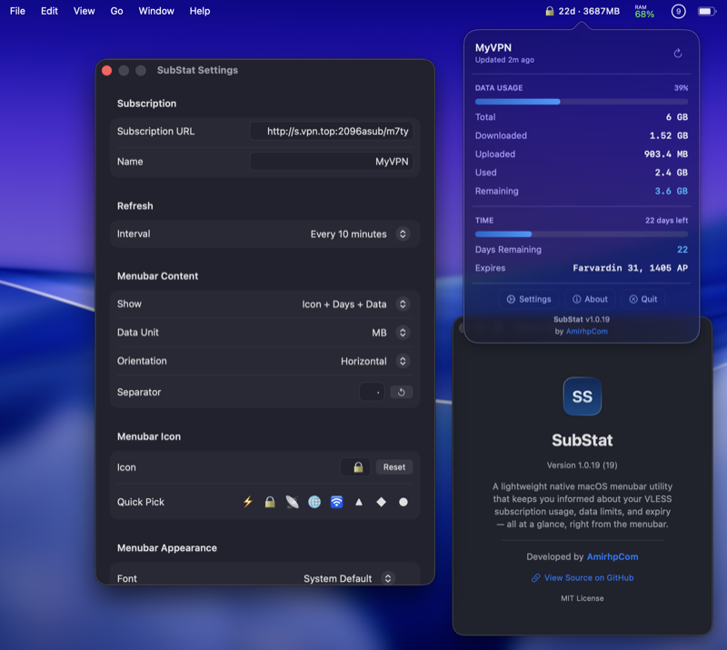

# SubStat

A lightweight native macOS menubar app that monitors your VLESS subscription usage in real-time.

  



## Features

- **Menubar Display** — See remaining days and data at a glance
- **Detailed Popup** — Click to view total, downloaded, uploaded, remaining data with color-coded progress bars
- **Auto Refresh** — Configurable refresh interval (30s, 2m, 5m, 10m, 30m, 1h, or manual)
- **Customizable Menubar** — 7 display modes (Data only, Days only, Data + Days, Icon + Data, Icon + Day, Icon + Data + Day, Icon + Day + Data); pick data unit (MB/GB/GBz), separator, font family, font size, text color, icon emoji, and orientation
- **Color-Coded Indicators** — Blue (healthy), orange (moderate), red (critical) for data and time remaining
- **Manual IP Resolver (VPN bypass)** — Reach your subscription host even when a system VPN is on: pin the host to a known IP via `/etc/hosts` and add a host route through the local gateway (auto-detected, with manual override)
- **Launch at Login** — Start automatically when you log in
- **Native macOS** — Built with Swift + SwiftUI, zero dependencies, lightweight, universal binary (Apple Silicon + Intel)
- **Supports X-UI / 3X-UI** — Reads `Subscription-Userinfo` HTTP header with HTML template fallback

## Download

Download the latest `.dmg` installer from the [Releases](https://github.com/amirhp-com/SubStat/releases) page.

## Build from Source

1. Clone the repository
2. Open `SubStat.xcodeproj` in Xcode 15+
3. Build and run (Cmd+R)

## Requirements

- macOS 13.0 (Ventura) or later
- A VLESS subscription URL from X-UI / 3X-UI panel

## Usage

1. Launch SubStat — it appears in your menubar
2. Click the menubar item to see detailed subscription info
3. Click **Settings** to configure:
   - Paste your subscription URL
   - Set a custom name
   - Choose data unit (Auto, MB, GB, GBz)
   - Customize font, size, color, icon, separator, orientation
   - Set refresh interval
4. Click **About** for app info and links

## How It Works

SubStat fetches your subscription URL and reads usage data from the `Subscription-Userinfo` HTTP response header. It also supports X-UI/3X-UI panels that provide data via HTML `<template>` elements as a fallback.

**Header format:**
```
Subscription-Userinfo: upload=XXX; download=XXX; total=XXX; expire=XXX
```

## Developer

**[AmirhpCom](https://amirhp.com/landing)**

## License

MIT License — see [LICENSE](LICENSE) for details.
